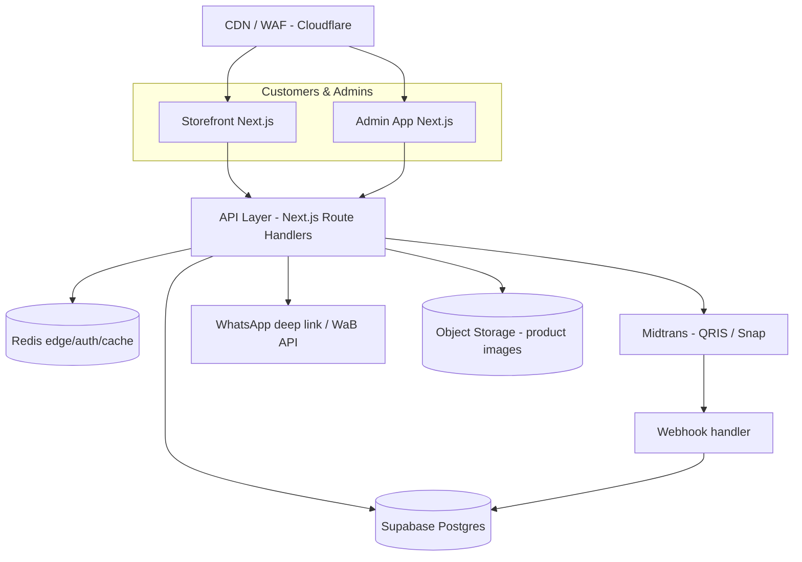

# ATLASE — System Documentation

> **Premium, Made Personal.** · Parfum Premium, Sesuai Kamu. · Wangi Mewah. Harga Bersahabat.

Atlase is an end-to-end fragrance commerce platform: luxury-look discovery, accessible Indonesian pricing, personalized fragrance formulation, WhatsApp-first ordering, direct QRIS (Midtrans) payment, centralized customer data, and admin-controlled dynamic pricing.

This directory is the system design source of truth. Every engineering decision should trace back to a document here.

## Spec principles that override everything

1. **Luxury visual, accessible price.** Looks premium. Feels simple. Costs less than it looks.
2. **Bahasa Indonesia sederhana.** No perfume jargon (fragrance load, concentration, formulation %) in customer-facing copy.
3. **WhatsApp is a channel, never the database.** Orders are persisted server-side first; WhatsApp only opens a structured message.
4. **Backend owns price.** Frontend previews; the pricing engine server-side is authoritative.
5. **Historical prices are immutable.** Every order stores price snapshots; admin price changes never rewrite past orders.
6. **Admin configures without code.** Pricing, fragrances, bottles, packaging, rules — all data, versioned and audited.
7. **Money is integer rupiah.** No floats for money anywhere.

## Master architecture (Mermaid)

## Document index

| Doc | Purpose |
|---|---|
| [README.md](./README.md) | This index; master architecture; design rules |
| [infrastructure.md](./infrastructure.md) | Environments, hosting, CDN, secrets, CI/CD, backups, scaling |
| [architecture.md](./architecture.md) | Modular monolith, domains, layering, module boundaries |
| [database.md](./database.md) | ERD, entities, indexes, constraints, enums, migrations, snapshots |
| [product.md](./product.md) | Product vision, personas, journeys, product & fragrance model |
| [ux.md](./ux.md) | Information architecture, journeys, mobile/desktop/checkout UX |
| [ui.md](./ui.md) | Screen-by-screen UI specification |
| [design-system.md](./design-system.md) | Tokens, components, motion, accessibility |
| [branding.md](./branding.md) | Brand identity, logo rules, tone, taglines |
| [copywriting.md](./copywriting.md) | Copy rules, phrasing, FAQ, do/don't |
| [pricing.md](./pricing.md) | Cost vs selling, formula, margin, discount, shipping, versions |
| [pricing-engine.md](./pricing-engine.md) | Exact calculation algorithm + test cases |
| [customization.md](./customization.md) | Volumes, min/max aroma, slider behavior, validation |
| [checkout.md](./checkout.md) | Cart, address, order creation, WhatsApp/payment paths |
| [whatsapp.md](./whatsapp.md) | Deep link, message template, channel attribution, admin workflow |
| [payment.md](./payment.md) | Payment abstraction, QRIS, webhook, idempotency, reconciliation |
| [midtrans.md](./midtrans.md) | Midtrans integration specifics |
| [admin.md](./admin.md) | Admin IA, roles, pricing, management, audit |
| [inventory.md](./inventory.md) | Stock, reservation, movements |
| [customer-data.md](./customer-data.md) | Customer profile, addresses, consents, unified record |
| [analytics.md](./analytics.md) | Events, funnel, privacy-conscious tracking |
| [seo.md](./seo.md) | Routes, metadata, structured data |
| [security.md](./security.md) | Threat model, authn/z, RBAC, webhook, secrets, incident response |
| [privacy.md](./privacy.md) | Indonesian privacy (UU PDP), consent, retention |
| [api.md](./api.md) | Versioned API contract, examples, error model |
| [testing.md](./testing.md) | Unit/integration/E2E strategy, pricing test cases |
| [deployment.md](./deployment.md) | Environments, pipelines, release process |
| [observability.md](./observability.md) | Logs, metrics, tracing, error tracking |
| [performance.md](./performance.md) | Detailed metrics, low-end hardware strategy |
| [motion.md](./motion.md) | Motion language, durations, easings, reduced-motion |
| [assets.md](./assets.md) | Image system, dimensions, formats, licensing |
| [content.md](./content.md) | Launch content, merchandising, editorial |
| [roadmap.md](./roadmap.md) | Phases, P0/P1/P2, vertical slices |
| [showly.md](./showly.md) | Placeholder — purpose TBD, do not invent scope |

## Non-negotiable facts (authoritative here)

| Fact | Value |
|---|---|
| Customer-facing language | Bahasa Indonesia (simple) |
| Taglines | EN: *Premium, Made Personal.* / ID: *Parfum Premium, Sesuai Kamu.* / Hook: *Wangi Mewah. Harga Bersahabat.* |
| Volume presets (initial, admin-configurable) | 30 / 50 / 70 / 100 ml |
| Aroma strength presets (initial) | Lembut / Sedang / Kuat + "Atur sendiri" slider |
| Money type | Integer rupiah (e.g. `89000`) |
| Default currency | `IDR` |
| Order ID format | `ATL-YYMMDD-######` (e.g. `ATL-260901-000128`) |
| Payment provider | Midtrans (initial: QRIS) |
| Database | Supabase PostgreSQL (RLS enabled) |
| Auth | Supabase Auth (email/OTP admin; guest order without account) |
| WhatsApp | `wa.me` deep link with structured message; WaB API later |
| Number formatting | `Rp89.000` (thousand separators, no decimal) |