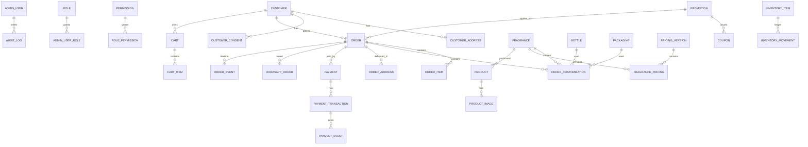
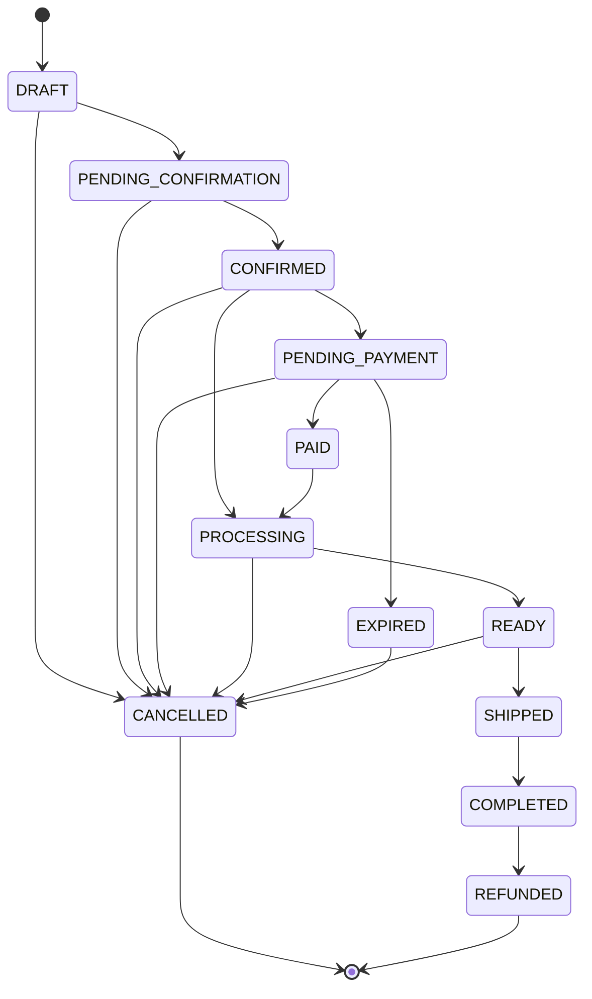

# ATLASE — Database

**Platform:** Supabase PostgreSQL 15+. All money as `BIGINT` integer rupiah (no floats). Primary keys `UUID` (`gen_random_uuid()`). All tables have `created_at`/`updated_at`. RLS enabled on exposed tables (see security.md).

## 1. ERD (Mermaid)



## 2. Entities & key columns

### Auth & admin
| Table | Key columns |
|---|---|
| `admin_users` | `id` uuid PK, email, password_hash, name, status enum(`ACTIVE`,`SUSPENDED`), 2fa_secret, last_login_at |
| `roles` | `id` uuid PK, code (`SUPER_ADMIN`,`ADMIN`,`OPERATIONS`,`FINANCE`,`CONTENT_MANAGER`,`CUSTOMER_SERVICE`), name, description |
| `admin_user_roles` | `admin_user_id` FK, `role_id` FK, unique(admin_user_id, role_id) |
| `permissions` | `id` uuid PK, `code` (e.g. `orders.read`,`orders.write`,`pricing.publish`), name |
| `role_permissions` | `role_id` FK, `permission_id` FK, unique pair |

### Customers
| Table | Key columns |
|---|---|
| `customers` | `id` uuid PK, `supabase_auth_id` uuid nullable (link to auth.users), `phone` unique, `email`, `name`, `is_marketing_consent` bool, `created_at`, `updated_at` |
| `customer_addresses` | `id` uuid PK, `customer_id` FK, `label`, `recipient_name`, `phone`, `province`, `city`, `district`, `subdistrict`, `postal_code`, `full_address`, `note`, `is_default` bool |
| `customer_consents` | `id` uuid PK, `customer_id` FK, `type` enum(`MARKETING`,`DATA_PROCESSING`,`WHATSAPP`), `granted` bool, `granted_at`, `revoked_at`, `source` |

### Catalog
| Table | Key columns |
|---|---|
| `fragrances` | `id` uuid PK, `slug` unique, `name`, `reference_label` nullable (e.g. "Inspired by Dior Sauvage"), `description`, `category`, `popularity_score`, `is_active` bool, `is_featured` bool, `min_ml`, `max_ml`, `is_custom_slider_enabled` bool, `image_id` FK nullable |
| `fragrance_pricing` | `id` uuid PK, `fragrance_id` FK, `cost_per_ml` bigint, `price_per_ml` bigint, `version_id` FK → pricing_versions, `active` bool, unique(fragrance_id, version_id) |
| `products` | `id` uuid PK, `slug` unique, `fragrance_id` FK, `status` enum(`DRAFT`,`PREVIEW`,`PUBLISHED`,`ARCHIVED`), `seo_title`, `seo_description` |
| `product_images` | `id` uuid PK, `product_id` FK nullable, `kind` enum(`primary`,`thumbnail`,`gallery`,`mobile`,`desktop`,`hover`,`transparent`), `url`, `alt`, `sort_order` |
| `bottles` | `id` uuid PK, `slug` unique, `name`, `volume_ml`, `cost_price` bigint, `sell_price` bigint, `image_url`, `stock` bigint, `is_active` bool |
| `packaging` | `id` uuid PK, `slug` unique, `name` (Standard/Premium/Gift/Custom), `cost_price` bigint, `sell_price` bigint, `is_mandatory` bool, `image_url`, `is_active` bool |
| `add_ons` | `id` uuid PK, `slug`, `name`, `description`, `cost_price`, `sell_price`, `is_active` bool | (future)

### Pricing
| Table | Key columns |
|---|---|
| `pricing_rules` | `id` uuid PK, `code`, `condition` jsonb (typed, structured: `{field, op, value}`), `effect` jsonb (additive amount / percentage), `priority` int, `is_active` bool, `description` |
| `pricing_versions` | `id` uuid PK, `label` (e.g. `v1.4`), `status` enum(`DRAFT`,`PREVIEW`,`PUBLISHED`,`ACTIVE`), `published_at`, `published_by` FK admin_users, `changelog` |

### Cart
| Table | Key columns |
|---|---|
| `carts` | `id` uuid PK, `customer_id` FK nullable, `session_key` uuid nullable, `status`, `totals` snapshot jsonb |
| `cart_items` | `id` uuid PK, `cart_id` FK, `fragrance_id` FK, `volume_ml` int, `fragrance_ml` int, `bottle_id` FK, `packaging_id` FK, `quantity` int, `unit_price` bigint, constraint volume=fragrance+alcohol derived |

### Orders
| Table | Key columns |
|---|---|
| `orders` | `id` uuid PK, `order_number` unique (ATL-YYMMDD-######), `idempotency_key` unique, `customer_id` FK, `channel` enum(`WHATSAPP`,`DIRECT_PAYMENT`,`ADMIN`), `status` enum (see §4), `currency` default `IDR`, `subtotal`,`discount`,`shipping`,`total` bigint, `payment_status` enum, `pricing_version_label`, `created_at`,`updated_at` |
| `order_items` | `id` uuid PK, `order_id` FK, `product_id` FK, `fragrance_id` FK, `unit_price_snapshot` bigint, `quantity`, `line_total` bigint |
| `order_customizations` | `id` uuid PK, `order_id` FK, `fragrance_id` FK, `volume_ml`, `fragrance_ml`, `alcohol_ml`, `bottle_id`, `packaging_id`, `addons` jsonb, `snapshot` jsonb (immutable full config: names + unit prices + ml) |
| `order_addresses` | `id` uuid PK, `order_id` FK, `customer_address_id` FK nullable, snapshot columns: `recipient_name`,`phone`,`province`,`city`,`district`,`subdistrict`,`postal_code`,`full_address`,`note` |
| `order_events` | `id` uuid PK, `order_id` FK, `event_type`, `from_status`, `to_status`, `actor_type`, `actor_id`, `note`, `created_at` |

### Payments
| Table | Key columns |
|---|---|
| `payments` | `id` uuid PK, `order_id` FK, `method` enum(`QRIS`), `provider` enum(`MIDTRANS`), `amount_requested` bigint, `amount_paid` bigint nullable, `status` enum(`PENDING`,`PAID`,`FAILED`,`EXPIRED`,`REFUNDED`) |
| `payment_transactions` | `id` uuid PK, `payment_id` FK, `provider_transaction_id` unique nullable, `provider_reference` (order_id from midtrans), `idempotency_key` unique, `status`, `amount`, `payload_request` jsonb, `payload_response` jsonb, `created_at` |
| `payment_events` | `id` uuid PK, `payment_id` FK, `event_type` enum(`CREATED`,`PENDING`,`SUCCESS`,`FAILURE`,`EXPIRY`,`REFUND`,`NOTIFICATION`), `raw_payload` jsonb, `verified` bool, `received_at` |

### WhatsApp
| Table | Key columns |
|---|---|
| `whatsapp_orders` | `id` uuid PK, `order_id` FK unique, `phone_target` text, `message_template_version`, `deep_link` text, `status` enum(`NOT_SENT`,`OPENED`,`CONFIRMED`,`PROCESSED`), `opened_at` nullable, `sent_at` |

### Inventory
| Table | Key columns |
|---|---|
| `inventory_items` | `id` uuid PK, `item_type` enum(`BOTTLE`,`PACKAGING`,`FRAGRANCE`), `item_id` uuid, `current_stock` bigint, `reserved_stock` bigint default 0, unique(item_type, item_id) |
| `inventory_movements` | `id` uuid PK, `item_type`, `item_id`, `movement_type` enum(`PURCHASE`,`RESERVATION`,`SALE`,`CANCELLATION`,`ADJUSTMENT`,`RETURN`), `qty`, `reference_order_id` nullable, `note`, `created_at` |

### Promotions (P1)
| Table | Key columns |
|---|---|
| `promotions` | `id` uuid PK, `code` nullable, `name`, `type` enum(`PERCENT`,`FIXED`), `value` bigint, `min_order` bigint, `scope` jsonb (fragrance/bottle/volume filters), `starts_at`,`ends_at`, `segment` nullable, `is_active` |
| `coupons` | `id` uuid PK, `promotion_id` FK, `coupon_code` unique, `max_uses`, `used_count`, `per_customer_limit` |

### Audit & settings
| Table | Key columns |
|---|---|
| `audit_logs` | `id` uuid PK, `admin_user_id` FK nullable, `action`, `entity_type`, `entity_id`, `old_value` jsonb, `new_value` jsonb, `reason` nullable, `ip`, `user_agent`, `created_at` (indexed) |
| `system_settings` | `key` pk, `value` jsonb, `updated_by`, `updated_at` |

### Analytics (§56, migration `0003`)
| Table | Key columns |
|---|---|
| `analytics_events` | `id` uuid PK, `event_type` text (indexed with `created_at desc`), `order_id` FK nullable, `customer_id` FK nullable, `session_id` text nullable, `metadata` jsonb, `created_at`. Service-role only — no anon/authenticated RLS policy. |

## 3. Enums (canonical)

```text
order_status:
  DRAFT → PENDING_CONFIRMATION → CONFIRMED → PENDING_PAYMENT → PAID
  → PROCESSING → READY → SHIPPED → COMPLETED
  | CANCELLED | EXPIRED | REFUNDED | FAILED

payment_status: PENDING | PAID | FAILED | EXPIRED | REFUNDED
channel: WHATSAPP | DIRECT_PAYMENT | ADMIN
bottle_status / packaging_status / fragrance_visibility: ACTIVE | INACTIVE
pricing_version_status: DRAFT | PREVIEW | PUBLISHED | ACTIVE
consent_type: MARKETING | DATA_PROCESSING | WHATSAPP
movement_type: PURCHASE | RESERVATION | SALE | CANCELLATION | ADJUSTMENT | RETURN
```

Postgres `ENUM` types for stable ordering; ensure strict transitions enforced in the **domain service** (single writer). Payments may be adjusted by webhooks only.

## 4. Order state machine (authoritative)



Transitions implemented only through `OrderService.transition(orderId, target)` which validates allowed move, writes `order_events`, and updates the row in one transaction.

## 5. Historical price snapshot (order_customizations.snapshot)

```json
{
  "fragrance": { "name": "Dior-inspired", "unitPricePerMl": 3000, "ml": 20 },
  "alcohol":   { "unitPricePerMl": 300, "ml": 30 },
  "bottle":    { "name": "Premium", "price": 15000, "volumeMl": 50 },
  "packaging": { "name": "Standard", "price": 5000 },
  "addons":    [],
  "discount":  0,
  "shipping":  0,
  "total":     89000
}
```

Admin price edits write new `fragrance_pricing` rows under a new `pricing_versions` entry. Past orders reference only the snapshot — never re-resolved.

## 6. Indexes (by query pattern)

```sql
CREATE INDEX idx_orders_customer ON orders(customer_id, created_at DESC);
CREATE INDEX idx_orders_status ON orders(status);
CREATE INDEX idx_orders_created ON orders(created_at DESC);
CREATE INDEX idx_orders_idem ON orders(idempotency_key);
CREATE INDEX idx_order_items_order ON order_items(order_id);
CREATE INDEX idx_fragrance_active ON fragrances(is_active, popularity_score DESC);
CREATE INDEX idx_fragrance_slug ON fragrances(slug);
CREATE UNIQUE INDEX uq_fragrance_pricing_active ON fragrance_pricing(fragrance_id) WHERE active;
CREATE INDEX idx_audit_entity ON audit_logs(entity_type, entity_id, created_at DESC);
CREATE INDEX idx_payment_events_payment ON payment_events(payment_id, received_at DESC);
CREATE INDEX idx_customers_phone ON customers(phone);
CREATE INDEX idx_whatsapp_order ON whatsapp_orders(order_id);
```

## 7. Migrations

- Supabase migration workflow (`supabase/migrations/`) with descriptive names. Every schema change gets a migration.
- Seeds under `database/seeds/` produce the demo catalog (see content.md) and default roles.

## 8. Retention

- `payment_events` raw payload: 12 months (financial audit), then stripped to verified fields.
- `audit_logs`: permanent (business requirement).
- Customer data: retained per consent; deletion flow by `CUSTOMER_SERVICE` honors UU PDP (see privacy.md).