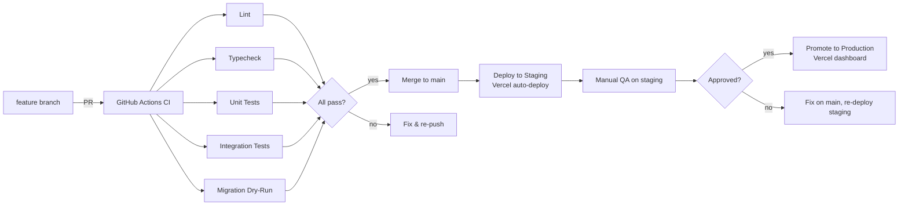
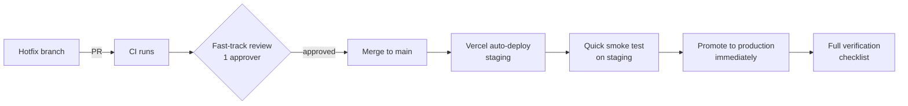

# ATLASE — Deployment

## 1. Environments Overview

| Environment  | Branch     | URL                      | Midtrans  | Supabase project   | Vercel project  |
| ------------ | ---------- | ------------------------ | --------- | ------------------ | --------------- |
| development  | any        | `localhost:3000`         | Sandbox   | local / remote dev | —               |
| staging      | `main`     | `staging.atlase.id`      | Sandbox   | `atlase-staging`   | `atlase-stg`    |
| production   | `main`*    | `atlase.id`              | Production| `atlase-prd`       | `atlase-prd`    |

> \* Production deploy is triggered manually after staging verification.

## 2. Release Pipeline



### CI Gates (every PR)

```bash
pnpm install --frozen-lockfile
turbo lint
turbo typecheck
turbo test
supabase db diff --use-migra --schema public   # migration dry-run
```

All gates must pass before merge.

### Deployment Steps

1. Merge PR to `main`.
2. Vercel auto-deploys `apps/web` and `apps/admin` to **staging**.
3. Run migrations on staging Supabase project (see section 3).
4. QA on staging: smoke tests, visual check, payment sandbox test.
5. Promote staging → production in Vercel dashboard (or `vercel --prod`).
6. Run migrations on production Supabase project.
7. Verify production (see section 7).

## 3. Database Migration Steps

### Supabase Migration Workflow

```bash
# 1. Generate a new migration (local development)
supabase migration new <migration_name>

# 2. Write SQL in supabase/migrations/<timestamp>_<name>.sql

# 3. Test locally
supabase db reset          # resets local DB, runs all migrations + seed

# 4. Push to remote (staging)
supabase db push           # applies pending migrations to linked Supabase project

# 5. Verify on staging
supabase db diff --use-migra   # confirm no drift
```

### Advisory Locking

Supabase migrations use advisory locks internally to prevent concurrent migration runs. Never run two `supabase db push` commands simultaneously against the same project.

### Production Migration

1. Verify migration works on staging first.
2. `supabase link --project-ref <production-project-ref>`
3. `supabase db push --linked` → confirms applied, no drift.
4. Monitor Sentry for post-migration errors.

**No migration should be applied directly to production without staging verification.**

## 4. Seed & Demo Data Handling

- **Local dev:** `supabase db reset` applies `supabase/seed.sql` automatically.
- **Staging:** Seed run manually after major schema changes or onboarding new team members.
- **Production:** Never seed. Production data is real customer data.
- **Seed file location:** `supabase/seed.sql` in repo root.

Seed includes:
- Sample product categories.
- 5-10 test products with images.
- Test user accounts (admin + customer).
- Sample addresses.

## 5. Environment Variable Matrix

### Shared (both apps)

| Variable                   | development      | staging            | production         | NEXT_PUBLIC |
| -------------------------- | ---------------- | ------------------ | ------------------ | ----------- |
| `NEXT_PUBLIC_SUPABASE_URL` | local/remote URL | staging URL        | production URL     | ✅           |
| `NEXT_PUBLIC_SUPABASE_ANON_KEY` | dev anon key | staging anon key   | production anon key | ✅          |
| `SUPABASE_SERVICE_ROLE_KEY`| dev key          | staging key        | production key     | ❌           |
| `SUPABASE_DB_URL`          | local/remote     | staging URL        | production URL     | ❌           |
| `DATABASE_URL`             | local/remote     | staging URL        | production URL     | ❌           |
| `REDIS_URL`                | local/remote     | staging URL        | production URL     | ❌           |
| `MIDTRANS_SERVER_KEY`      | sandbox key      | sandbox key        | **production key** | ❌           |
| `MIDTRANS_CLIENT_KEY`      | sandbox key      | sandbox key        | **production key** | ❌           |
| `MIDTRANS_MERCHANT_ID`     | sandbox          | sandbox            | production         | ❌           |
| `MIDTRANS_IS_SANDBOX`      | `true`           | `true`             | `false`            | ❌           |
| `NODE_ENV`                 | `development`    | `production`       | `production`       | ❌           |
| `NEXTAUTH_SECRET`          | dev secret       | staging secret     | production secret  | ❌           |
| `SENTRY_DSN`               | —                | staging DSN        | production DSN     | ❌           |

### apps/web only

| Variable               | development | staging | production | NEXT_PUBLIC |
| ---------------------- | ----------- | ------- | ---------- | ----------- |
| `WHATSAPP_PHONE_NUMBER`| dev number  | staging | production | ❌           |
| `STORE_URL`            | localhost   | staging URL | production URL | ❌     |

### apps/admin only

| Variable                   | development | staging | production | NEXT_PUBLIC |
| -------------------------- | ----------- | ------- | ---------- | ----------- |
| `ADMIN_ALLOWED_ORIGINS`    | localhost   | staging URL | production URL | ❌     |
| `ADMIN_SECRET`             | dev secret  | staging secret | production secret | ❌ |

### Rules

- **`NEXT_PUBLIC_` prefix = client-visible.** Only `SUPABASE_URL` and `SUPABASE_ANON_KEY` use this prefix.
- **`MIDTRANS_*` keys are NEVER client-visible.** Server-only.
- **Never use production Midtrans keys in development or staging.** Use sandbox keys.
- **`.env.example`** is committed with placeholder values. `.env.local` is gitignored.

## 6. Rollback Procedure

### Code Rollback (Vercel)

1. Go to Vercel dashboard → Deployments.
2. Find the last known good deployment.
3. Click "..." → "Promote to Production".
4. Instant rollback; no migration reversal needed for non-breaking changes.

### Database Rollback

1. **If migration is backward-compatible:** Just rollback code; old queries still work.
2. **If migration is breaking:**
   - Write a new forward-migration that undoes the change.
   - Apply to staging first, verify, then production.
   - Never `DROP` a migration that was already applied.

### Midtrans Rollback

If a payment-related release causes issues:
1. Rollback code to previous Vercel deployment.
2. Unpaid orders remain in `pending` status; customers can retry.
3. No payment data is lost (Midtrans is the source of truth for transactions).

## 7. Post-Deploy Verification Checklist

After every production deploy, verify:

- [ ] **Smoke test — storefront loads:** Visit `atlase.id`, check homepage renders.
- [ ] **Smoke test — product page:** Navigate to a product, images load, price shows in IDR.
- [ ] **Smoke test — quote API:** `POST /api/quote` returns valid shipping estimate.
- [ ] **Order creation (sandbox):** Create a test order, confirm Midtrans QRIS sandbox modal appears.
- [ ] **Webhook simulation:** Trigger a test webhook from Midtras sandbox → verify order status updates.
- [ ] **Admin login:** Log in to `atlase.id/admin`, check RBAC roles load.
- [ ] **Image upload:** Upload a test product image via admin → confirm it appears on storefront.
- [ ] **Rate limiting:** Send 20 rapid requests to `/api/quote` → confirm 429 response after limit.
- [ ] **Sentry:** Check Sentry dashboard for new errors in last 10 minutes.
- [ ] **No console errors:** Open browser DevTools, check for uncaught exceptions.

## 8. Hotfix Process

When a critical bug is found in production:



### Steps

1. Create `hotfix/<description>` branch from `main`.
2. Fix the issue; keep changes minimal.
3. PR with single reviewer approval (expedited).
4. Merge → auto-deploy to staging.
5. Quick smoke test on staging (< 5 minutes).
6. Promote to production.
7. Run full post-deploy verification (section 7).
8. If database migration is required: apply to staging, verify, then production (even for hotfixes).

**Never skip staging, even for hotfixes.** The staging check can be fast but must exist.

### Hotfix Escalation

If the hotfix introduces a new critical issue:
1. Immediate Vercel rollback to previous deployment.
2. Investigate root cause.
3. Fix, re-test on staging, re-deploy.

**RTO for hotfix:** < 15 minutes from merge to production verification.
