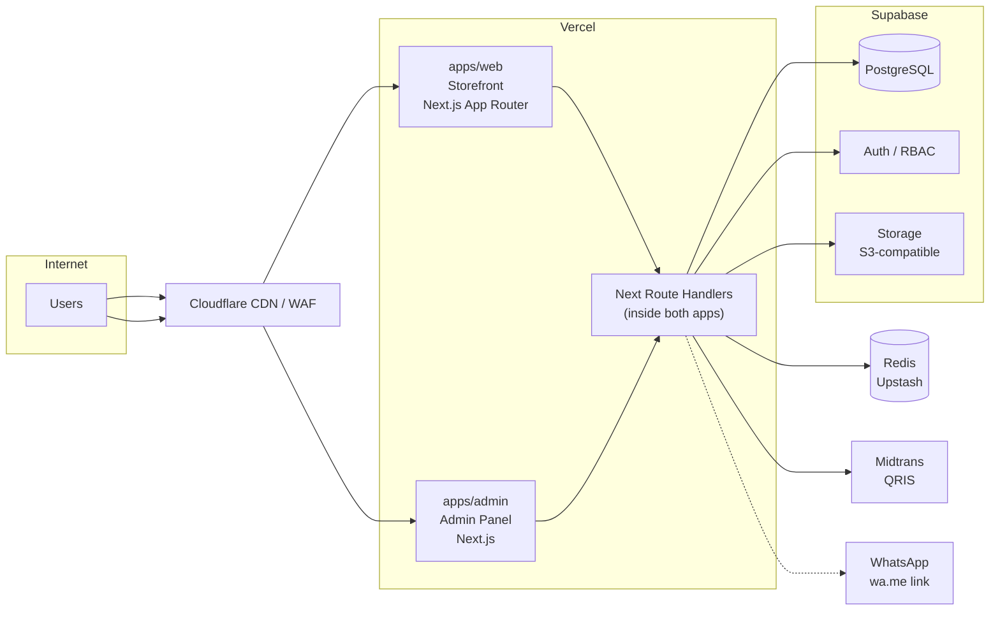
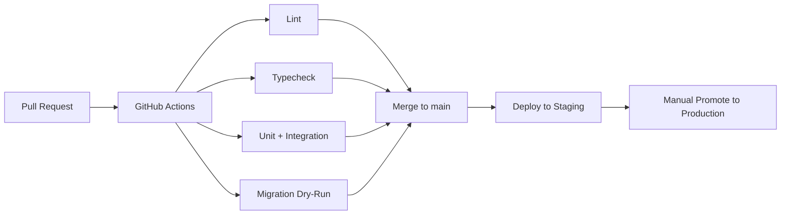

# ATLASE — Infrastructure

## 1. Architecture Overview

**Design principle:** Modular monolith. One deployable unit per app; no separate API server. Route handlers live inside `apps/web` and `apps/admin`.

## 2. Environments

| Environment | Purpose            | Supabase project | Midtrans   | Vercel project | Custom domain        |
| ----------- | ------------------ | ---------------- | ---------- | -------------- | -------------------- |
| development | Local dev          | local or remote  | Sandbox    | —              | localhost            |
| staging     | Pre-release QA     | Dedicated proj   | Sandbox    | `atlase-stg`   | staging.atlase.id   |
| production  | Live traffic       | Dedicated proj   | Production | `atlase-prd`   | atlase.id            |

## 3. Frontend & Backend Hosting

- **Platform:** Vercel (both apps).
- **apps/web** — storefront (Next.js App Router). Public-facing.
- **apps/admin** — admin panel (Next.js). Protected by Supabase Auth with RBAC roles.
- **API layer** = Next.js Route Handlers co-located in each app. No separate API service.
- Both apps share packages under `packages/` (ui, pricing, domain, validation, config, types).

## 4. Database

- **Engine:** Supabase managed PostgreSQL.
- **Migrations:** Supabase CLI (`supabase migration`) versioned in `supabase/migrations/`.
- **PITR:** Enabled on paid plans for point-in-time recovery.
- **Connection pooling:** Supabase built-in pooler (PgBouncer) for serverless functions.
- **Schema:** Multi-tenant ready from day one (`tenant_id` column on relevant tables) even if single-tenant at launch.

## 5. Cache & Rate Limiting

- **Provider:** Upstash Redis (serverless-friendly, pay-per-request).
- **Use cases:**
  - Rate limiting (sliding window via `@upstash/ratelimit`).
  - Idempotency keys for order creation.
  - Caching product catalog reads (short TTL, invalidated on admin publish).
- **No persistent data in Redis.** All authoritative data lives in Postgres.

## 6. Object Storage (Images)

- **Provider:** Supabase Storage (S3-compatible API).
- **Buckets:**
  - `product-images` — public read, admin write via signed upload.
- **Workflow:** Admin uploads image → Supabase Storage → public URL stored in `products.image_url` column.
- **CDN:** Cloudflare caches storage URLs automatically.

## 7. CDN & WAF

- **Cloudflare** sits in front of the Vercel deployment.
- **DNS:** Cloudflare-managed (proxy enabled for apex + www).
- **WAF rules:** Basic bot mitigation, geo-blocking if needed, rate-limit headers forwarded to app.
- **Cache:** Static assets cached at edge; API responses cached only when explicitly marked (product pages).
- **SSL:** Cloudflare origin certificate → Vercel edge TLS (full strict).

## 8. DNS

| Record | Type | Target                 | Notes               |
| ------ | ---- | ---------------------- | ------------------- |
| `@`    | A    | Cloudflare proxy       | Apex domain         |
| `www`  | CNAME| Cloudflare proxy       | Redirect to apex    |
| `_vercel` | TXT | Vercel domain verify | Custom domain setup |

Staging uses a subdomain: `staging.atlase.id`.

## 9. Secrets Management

| Principle | Detail |
| --------- | ------ |
| Env vars per environment | Vercel project settings or `.env.local` for local dev |
| Never in client bundle | Server-only keys (MIDTRANS, DB password) excluded from `NEXT_PUBLIC_` prefix |
| `NEXT_PUBLIC_` whitelist | Only `NEXT_PUBLIC_SUPABASE_URL`, `NEXT_PUBLIC_SUPABASE_ANON_KEY` |
| Local dev | `.env.local` (gitignored); `.env.example` committed with placeholder values |
| Staging/prod | Set in Vercel dashboard; mirrored in Supabase project settings if needed |

**Never commit production secrets to the repository.**

## 10. CI/CD

- **CI:** GitHub Actions. Runs on every PR.
- **Steps:** `pnpm install` → `turbo lint` → `turbo typecheck` → `turbo test` → `supabase db diff --dry-run`.
- **CD:** Vercel auto-deploys `main` to staging. Production requires manual approval in Vercel dashboard.
- **DB migrations:** Run via `supabase migration up` against staging first, then production after verification.

## 11. Backups

| Component     | Method                                  | RPO          |
| ------------- | --------------------------------------- | ------------ |
| PostgreSQL    | Supabase PITR (paid plan)              | < 5 min      |
| Storage       | Supabase managed backup                | Daily        |
| Redis         | Not backed up (ephemeral cache)         | —            |
| Source code   | GitHub                                 | Real-time    |
| Env vars      | Manual export (encrypted) or 1Password  | On change    |

## 12. Monitoring

| Tool       | Scope                                          |
| ---------- | ---------------------------------------------- |
| Sentry     | Error tracking for both apps (client + server) |
| Vercel     | Build logs, function logs, analytics           |
| Supabase   | Database metrics, auth logs, storage usage     |
| Upstash    | Redis latency, request count                   |
| Cloudflare | Traffic, cache hit ratio, security events      |

**Alerts:** Sentry alerts → Slack/Discord webhook. Supabase alerts for DB CPU/memory thresholds.

## 13. Scaling Strategy

**MVP:** Modular monolith on Vercel serverless. No separate API process.

- **Vercel:** Auto-scales serverless functions. Sufficient for initial traffic.
- **Supabase:** Vertical scaling (more CPU/RAM) then read replicas if needed.
- **Redis:** Upstash scales to millions of commands/day on pay-per-request.
- **When to split:** Only if traffic or complexity demands it. No premature microservices.

Scale-up triggers:
- > 10k concurrent users → evaluate Vercel Pro plan limits.
- > 100k orders/month → evaluate dedicated database instance.
- > 500ms p95 API latency → profile before splitting.

## 14. Disaster Recovery

| Scenario                    | Recovery                                |
| --------------------------- | --------------------------------------- |
| Database corruption         | Supabase PITR restore to pre-incident   |
| Bad deployment              | Vercel instant rollback to previous SHA |
| Midtrans outage             | Queue orders; retry webhook processing  |
| Cloudflare outage           | DNS failover to Vercel's default domain |
| Supabase outage             | Status page + cached pages serve stale  |
| Secrets compromise          | Rotate all keys; revoke Supabase tokens |

**RTO target:** < 15 minutes for deployment rollback; < 1 hour for database restore.

**Runbook:** Document step-by-step in `docs/runbooks/` (create when first incident occurs).
