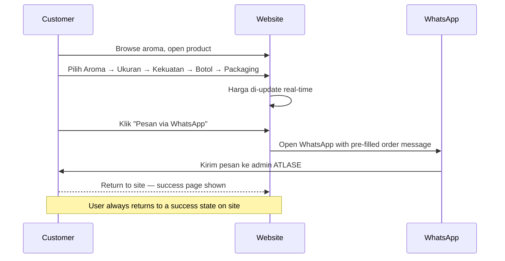
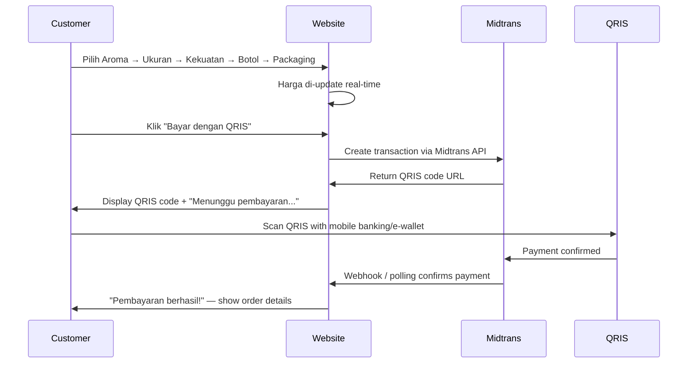
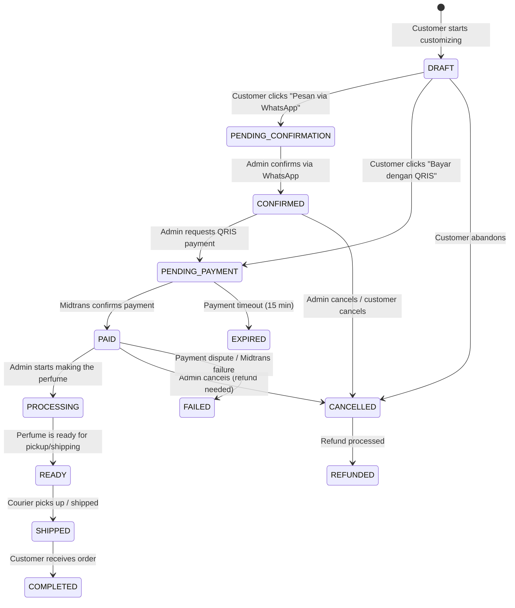

# ATLASE — Product Documentation

> **Premium, Made Personal.** | **Parfum Premium, Sesuai Kamu.**
> Wangi Mewah. Harga Bersahabat.

---

## 1. Product Vision

**Looks premium. Feels simple. Costs less than it looks.**

ATLASE is an Indonesian fragrance commerce platform that lets customers build their own perfume online and receive it at their door. The core contradiction we exploit is deliberate: the visual language, typography, and packaging scream luxury — while the pricing starts at Rp29.000. This is not a discount brand dressed up. It is a premium-feeling experience with an intentionally accessible price floor, built for the Indonesian market.

Three pillars:

- **Looks premium.** Dark tones, clean typography, generous whitespace. Every screen should feel like it costs 10x the actual price.
- **Feels simple.** No perfume jargon. No "fragrance load" or "concentration percentages." Customers choose a scent, pick a size, adjust strength, and order. That's it.
- **Costs less than it looks.** "Mulai dari Rp29.000" is a trust signal. Transparent pricing at every step removes hesitation.

---

## 2. Target Users & Personas

### 2.1 Rina — Young Professional (25, Jakarta)

Pekerja kantoran gaji UMR+. Mau wangi enak tapi nggak mau bayar parfum branded yang Rp500rb+. Suka eksperimen, sering beli buat diri sendiri. Paling sering lewat WhatsApp karena nggak ribet.

**Key motivation:** Ingin terlihat tanpa menghabiskan banyak uang. Suka kalau bisa pilih sendiri aromanya.

### 2.2 Adit — University Student (21, Bandung)

Mahasiswa aktif. Budget tipis tapi peduli penampilan. Belajar dari TikTok tentang parfum "inspired by" yang mirip mahal. Senang kalau harga transparan dari awal.

**Key motivation:** Cari yang paling murah tapi tetap wangi enak. Suka fitur "Atur sendiri" buat kontrol harga.

### 2.3 Sari — Gift Buyer (30, Surabaya)

Ibu muda, suka kasih hadiah buat suami, sahabat, atau orang tua. Butuh parfum custom yang personal tapi nggak mahal. Lebih suka bayar QRIS karena simple.

**Key motivation:** Hadiah yang personal dan terlihat mahal. Butuh packaging bagus tapi harga tetap masuk akal.

---

## 3. User Journeys

### 3.1 Happy Path — WhatsApp Order



**Steps:**

1. Customer browses aroma collection on website.
2. Opens a product, starts customizing (7-step flow).
3. Price updates live on every change.
4. Clicks **"Pesan via WhatsApp"**.
5. WhatsApp opens with a structured, pre-filled order message containing: aroma, ukuran, kekuatan, botol, packaging, and total harga.
6. Customer sends message to ATLASE admin.
7. Customer returns to website — sees a confirmation/success page regardless of WhatsApp state.

### 3.2 Happy Path — QRIS Order



**Steps:**

1. Customer completes 7-step customization.
2. Clicks **"Bayar dengan QRIS"**.
3. Website creates a Midtrans transaction, receives QRIS code.
4. QRIS code displayed with "Menunggu pembayaran..." status.
5. Customer scans with any Indonesian banking/e-wallet app.
6. Payment confirmed via Midtrans webhook or polling.
7. Customer sees **"Pembayaran berhasil!"** with order summary.

### 3.3 Returning Customer

Returning customer has no saved session (mobile-first, privacy-conscious). The flow is identical to first-time, but the website may show "Pesan lagi" (order again) as a shortcut if they previously completed an order via cookie/localStorage hint. No account required.

### 3.4 Gift Ordering

Gift ordering follows the same customization flow. The difference is at checkout:

- Customer fills in recipient's name and address (not their own).
- Packaging defaults to **Gift** tier.
- WhatsApp message includes a gift note field: "Tulis pesan untuk penerima:"
- The recipient receives the order; the buyer gets confirmation via WhatsApp.

---

## 4. Product Hierarchy

```
ATLASE (Brand)
  └── Product (e.g., "Eau de Parfum Custom")
        └── Fragrance (individual scent, e.g., "Oud Velvet")
              ├── Size Variant: 30ml / 50ml / 70ml / 100ml
              ├── Kekuatan Aroma: Lembut / Sedang / Kuat / Atur Sendiri
              ├── Botol: Standard / Premium
              └── Packaging: Standard / Premium / Gift
```

**Key rules:**

- One product type (custom EDP). No multiple product lines at launch.
- Fragrances are the primary selection axis. Each fragrance has a per-ml base price.
- Size, strength, bottle, and packaging are modifiers applied on top of the fragrance base.
- Pricing is dynamic: total = (fragrance × size) × strength_multiplier + bottle_upgrade + packaging_upgrade.

---

## 5. Fragrance Model

### 5.1 Inspired-By Positioning

Each fragrance uses **"Inspired by [Reference]"** wording. This is a legal, industry-standard positioning — it communicates scent similarity without implying affiliation, endorsement, or original formulation.

**Examples:**

| ATLASE Fragrance | Inspired By | Notes |
|---|---|---|
| Oud Velvet | Inspired by Tom Ford Oud Wood | Woody, warm, unisex |
| Lemon Breeze | Inspired by Dior Sauvage | Fresh, citrus, masculine |
| Rose Garden | Inspired by Chanel Chance Eau Tendre | Floral, sweet, feminine |

**Rules:**

- Always use "Inspired by [Brand] [Product Name]" — never "Dup of…" or "Clone of…"
- Never use original brand logos, bottles, or trade dress in marketing.
- Include a visible disclaimer: "ATLASE tidak berafiliasi dengan brand manapun. 'Inspired by' menunjukkan kesamaan aroma, bukan afiliasi."

### 5.2 Per-Fragrance Pricing

Each fragrance has a **base price per ml** set by the admin. This is the foundation of all pricing calculations.

Example:

| Fragrance | Base Price/ml |
|---|---|
| Oud Velvet | Rp1.200/ml |
| Lemon Breeze | Rp900/ml |
| Rose Garden | Rp1.100/ml |

**Minimum order:** 30ml (smallest size). **Maximum order:** 100ml (largest size).

---

## 6. Customization Model — The 7-Step Flow

The customization flow is the heart of ATLASE. Every step is designed to be skippable for quick buyers, but powerful for explorers.

### Step 1: Pilih Aroma

Browse the fragrance collection. Filter by category (Woody, Floral, Fresh, Sweet, Oriental). Tap to select. Multiple aromas can be combined (blend).

### Step 2: Pilih Ukuran

Choose bottle size: **30ml / 50ml / 70ml / 100ml**.

Display: "Semakin besar, semakin hemat per ml."

### Step 3: Atur Kekuatan

Choose aroma strength:

| Preset | Label | Explanation |
|---|---|---|
| Lembut | "Cocok buat sehari-hari" | Wangi ringan, nggak overpowering |
| Sedang | "Paling populer" | Wangi pas — nggak terlalu kuat, nggak terlalu lembut |
| Kuat | "Tahan seharian penuh" | Wangi kuat, cocok buat acara spesial |
| Atur Sendiri | "Sesuai selera kamu" | Slider 1–10 dengan penjelasan live |

**Human explanation always visible:** "Semakin banyak aroma, wanginya semakin terasa."

### Step 4: Pilih Botol

| Botol | Description | Price Impact |
|---|---|---|
| Standard | Botol kaca bening, desain simpel | Included (Rp0) |
| Premium | Botol kaca tebal, cap logam, lebih berat | +Rp15.000 |

### Step 5: Pilih Packaging

| Packaging | Description | Price Impact |
|---|---|---|
| Standard | Kotak ATK putih | Included (Rp0) |
| Premium | Kotak rigid, ribbon | +Rp10.000 |
| Gift | Kotak rigid + kartu ucapan + tissue | +Rp20.000 |

### Step 6: Lihat Harga

Summary screen showing:

- Aroma yang dipilih
- Ukuran
- Kekuatan
- Botol
- Packaging
- **Total harga** (bold, prominent)

"Mulai dari Rp29.000" is always visible as a floor anchor.

### Step 7: Lanjut Pesan

Choose order channel:

- **Pesan via WhatsApp** (recommended, primary CTA)
- **Bayar dengan QRIS** (direct payment)

---

## 7. Business Rules

### 7.1 Formula Volume

The physical formula is always:

```
Total Volume = Fragrance Oil Volume + Alcohol Volume
```

The ratio depends on the kekuatan (strength) setting:

| Kekuatan | Fragrance Oil % | Alcohol % |
|---|---|---|
| Lembut | 10% | 90% |
| Sedang | 20% | 80% |
| Kuat | 30% | 70% |
| Atur Sendiri | 5%–40% (slider) | 60%–95% |

**Example:** 50ml bottle at "Sedang" = 10ml fragrance oil + 40ml alcohol.

### 7.2 Min/Max Per Fragrance

- Minimum fragrance oil per individual scent: 5ml (for blends — ensures each aroma is perceptible).
- Maximum fragrance oil per individual scent: equal to the total formula capacity at the chosen strength.

### 7.3 Bottle Capacity

Bottle physical capacity = selected size (30/50/70/100ml). The formula fills to this capacity. Admin cannot override this at runtime.

### 7.4 Mandatory Packaging

Packaging is always required. Default is **Standard** (Rp0). Customer must explicitly choose; it is never skipped.

### 7.5 Snapshot Pricing

When a customer completes customization and proceeds to order:

- The **total price is locked at that moment** and stored with the order.
- If admin changes fragrance pricing or size pricing after the order is placed, the historical order retains the original price.
- This is critical for order integrity and customer trust.

---

## 8. Order Lifecycle



### State Descriptions

| State | Description |
|---|---|
| **DRAFT** | Customer is customizing. Not yet submitted. |
| **PENDING_CONFIRMATION** | WhatsApp message sent. Waiting for admin to confirm. |
| **CONFIRMED** | Admin confirmed the order. Awaiting payment (QRIS). |
| **PENDING_PAYMENT** | QRIS code displayed. Waiting for customer to pay. |
| **PAID** | Payment received and confirmed by Midtrans. |
| **PROCESSING** | Perfume is being mixed and prepared. |
| **READY** | Perfume is ready. Awaiting courier or customer pickup. |
| **SHIPPED** | Handed to courier. In transit. |
| **COMPLETED** | Customer has received the order. |
| **CANCELLED** | Order cancelled by admin or customer. |
| **EXPIRED** | QRIS payment window expired (15 min timeout). |
| **REFUNDED** | Payment refunded after cancellation. |
| **FAILED** | Payment failed or disputed. |

---

## 9. Commercial Constraints

### 9.1 Admin-Configurable Pricing

All prices are set by the admin via a management dashboard:

- Fragrance base price per ml
- Size tier pricing (if any additional markup per size)
- Kekuatan multiplier per tier
- Botol upgrade pricing
- Packaging upgrade pricing
- WhatsApp discount (optional)
- QRIS discount (optional, to incentivize direct payment)

### 9.2 Historical Price Immutability

Once an order is placed, the price snapshot is immutable. This means:

- Admin can change prices at any time for new orders.
- Existing orders always reflect the price at the time of purchase.
- Refunds are processed against the original snapshot price, not the current catalog price.
- Price change logs are maintained for audit.

### 9.3 Pricing Transparency Rule

Every screen that shows a price must show the **full breakdown** — not just the total. Customers must see: aroma cost + size cost + kekuatan cost + botol cost + packaging cost = total.

Hidden fees are a brand violation. If a cost appears, it must be explained in simple Bahasa Indonesia.
