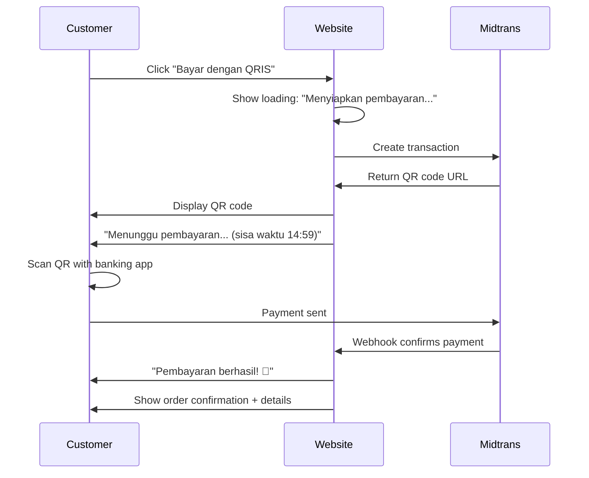

# ATLASE — UX Documentation

> **Premium, Made Personal.** | **Parfum Premium, Sesuai Kamu.**
> Wangi Mewah. Harga Bersahabat.

---

## 1. Information Architecture

### 1.1 Sitemap

ATLASE is deliberately **shallow** — maximum 2 clicks from Home to any action.

```
Home
├── Aroma / Koleksi
│   ├── Kategori (Woody, Floral, Fresh, Sweet, Oriental)
│   └── Detail Aroma (e.g., "Oud Velvet — Inspired by Tom Ford Oud Wood")
├── Buat Parfum (Customization Flow)
│   └── 7-Step Builder (inline, no page transitions)
├── Keranjang / Checkout
│   ├── 01 Pesanan
│   ├── 02 Alamat
│   └── 03 Cara Pesan (WhatsApp / QRIS)
├── FAQ
└── Pesanan Saya (lookup by WhatsApp number)
```

### 1.2 Navigation Priority

| Priority | Element | Why |
|---|---|---|
| 1 | **Buat Parfum** | Core CTA. Highest conversion path. |
| 2 | **Aroma / Koleksi** | Discovery. Helps customers who don't know what they want yet. |
| 3 | **Keranjang** | Checkout. Only relevant after customization. |
| 4 | **FAQ** | Trust + objection handling. |

---

## 2. Core Customer Journey Map

The customer journey is staged to match the 7 "customer feels" sequence — from first impression to confident purchase.

### Stage 1: "Kelihatan Mahal" (Looks Expensive)

**Screen:** Home / Landing

**Customer feels:** "Wah, ini website parfum mahal ya?"

**Design action:**

- Dark background, serif or elegant sans-serif typography.
- Hero image: perfume bottle with soft lighting, premium aesthetic.
- Tagline: **"Premium, Made Personal."**
- No price visible yet — let the premium feel land first.

**Trust cues:** Clean layout, professional photography, no clutter.

### Stage 2: "Mulai dari Rp29.000?" (Starts at Rp29,000?)

**Screen:** Home (below hero) or Collection page

**Customer feels:** "Loh, murah juga ternyata."

**Design action:**

- **"Mulai dari Rp29.000"** displayed prominently — this is the first price anchor.
- "Harga transparan dari awal" as supporting text.
- Visual contrast: luxury aesthetic + affordable number = cognitive dissonance that draws attention.

### Stage 3: "Pilih Aroma" (Choose a Scent)

**Screen:** Aroma / Koleksi

**Customer feels:** "Banyak pilihan, ada yang aku suka."

**Design action:**

- Grid of fragrance cards. Each card shows: name, "Inspired by [Brand]", one-line descriptor (e.g., "Woody, hangat, unisex").
- Category filters at top: Semua | Woody | Floral | Fresh | Sweet | Oriental.
- Tap card → opens product detail with scent notes description.
- No perfume jargon. Use: "Aroma ini mirip parfum [Brand] yang terkenal."

### Stage 4: "Atur Sendiri" (Customize It)

**Screen:** Buat Parfum (7-step inline flow)

**Customer feels:** "Aku bisa pilih sendiri. Seru."

**Design action:**

- Steps are shown as a single scrollable page (no page transitions, no loading).
- Progress indicator at top: Step 1 of 7 → Step 2 of 7 → ... → Step 7 of 7.
- Each step has a clear header, simple explanation, and visual selection (cards or buttons).

**Critical UX rule:** Every strength option includes a human explanation:

| Option | Text |
|---|---|
| Lembut | "Cocok buat sehari-hari. Wangi ringan, nggak overpowering." |
| Sedang | "Paling populer. Wangi pas — nggak terlalu kuat, nggak terlalu lembut." |
| Kuat | "Tahan seharian penuh. Cocok buat acara spesial." |
| Atur Sendiri | "Semakin banyak aroma, wanginya semakin terasa." + slider |

### Stage 5: "Harga Berubah" (Price Changes Live)

**Screen:** Buat Parfum (bottom sticky bar / inline summary)

**Customer feels:** "Aku tahu persis berapa harganya."

**Design action:**

- **Live price update** on every selection change. No delay.
- Price summary is always visible (sticky bottom bar on mobile).
- Format: Bold Rp number. E.g., **Rp87.000**
- If price increases: smooth number animation (count-up). If price decreases: same animation down.
- "Harga sudah termasuk semua" — no hidden fees.

### Stage 6: "Gampang" (Easy)

**Screen:** Checkout (minimal 3-step)

**Customer feels:** "Cuma 3 langkah? Gampang banget."

**Design action:**

- Checkout has 3 steps, all on one page or minimal navigation:
  1. **01 Pesanan** — summary of customization
  2. **02 Alamat** — shipping address
  3. **03 Cara Pesan** — WhatsApp or QRIS
- No account creation. No login. No unnecessary fields.
- Address can be pasted from clipboard (mobile-optimized).

### Stage 7: "Tinggal WhatsApp" (Just WhatsApp It)

**Screen:** Checkout → WhatsApp handoff

**Customer feels:** "Aku tinggal kirim, udah deh."

**Design action:**

- Primary CTA: **"Pesan via WhatsApp"** — green button, large, centered.
- Secondary CTA: **"Bayar dengan QRIS"** — outlined button below.
- On WhatsApp click: opens WhatsApp with a pre-filled structured message:

```
Halo ATLASE! Saya mau pesan parfum custom.

Aroma: Oud Velvet (Inspired by Tom Ford Oud Wood)
Ukuran: 50ml
Kekuatan: Sedang (20%)
Botol: Premium
Packaging: Gift

Total: Rp137.000

Konfirmasi ya, Kak!
```

- After WhatsApp opens, user returns to site → sees **"Pesanan kamu sudah dikirim!"** success page.

---

## 3. Mobile UX

### 3.1 Design Principles

- **Mobile-first.** Every screen designed for 360px minimum width.
- **Touch targets minimum 44px.** Buttons are large and easy to tap.
- **Thumb-friendly.** Primary actions in bottom half of screen.
- **Slow network safe.** No heavy animations. Images lazy-loaded. Skeleton screens for all loading states.
- **Affordable Android tested.** Must work on low-RAM devices (2GB+). No WebGL, no heavy JS frameworks.

### 3.2 Bottom Navigation (Conditional)

Bottom nav is **not** part of the default design. ATLASE is intentionally minimal — the customization flow is the primary path, and a persistent nav bar competes with the CTA.

If testing shows users struggle to navigate back, introduce bottom nav with:

| Tab | Icon | Label |
|---|---|---|
| Home | House | Beranda |
| Aroma | Flask/drop | Aroma |
| Buat Parfum | Plus | Buat Parfum |
| Keranjang | Bag | Keranjang |

**Decision:** A/B test bottom nav vs. floating CTA button after launch.

### 3.3 Key Mobile Patterns

- **Hero section:** Full-width image, tagline overlay, single CTA button.
- **Fragrance grid:** 2-column card grid. Each card: image, name, "Inspired by", price.
- **Customization flow:** Vertical stack, one step at a time. Each step expands/collapses.
- **Sticky price bar:** Bottom of screen during customization. Shows current total + "Lanjut Pesan" button.
- **WhatsApp button:** Full-width, green, bottom-fixed during checkout.

---

## 4. Desktop UX

### 4.1 Layout

- **Max content width:** 1200px, centered.
- **Hero:** Richer — can include video background (MP4, muted, looping) or parallax image.
- **Fragrance grid:** 3–4 column grid with hover states (scale, shadow lift).
- **Customization flow:** Two-column layout — left side: step selector / preview; right side: live price summary.

### 4.2 Cart Drawer

- Opens from the right side as a slide-in panel (not a separate page).
- Triggered by cart icon in header.
- Shows: item list, quantities, total price, "Lanjut ke Checkout" button.
- Can be closed by clicking outside or pressing Escape.

### 4.3 Keyboard Accessibility

- All interactive elements are focusable and operable via keyboard.
- Tab order follows visual flow: logo → nav → hero CTA → content → footer.
- Modals (cart drawer, image lightbox) trap focus and close on Escape.
- QRIS modal: focus trapped, close button keyboard-accessible.

---

## 5. Customization UX

### 5.1 Presets + "Atur Sendiri"

The strength step is the most important UX moment. It combines simplicity with control:

**Default view (presets):**

```
[ Lembut ]  [ Sedang ★ ]  [ Kuat ]  [ Atur Sendiri ]
 "Ringan"    "Populer"     "Kuat"     "Pilih sendiri"
```

When "Atur Sendiri" is tapped, a slider appears:

```
1 ──────────●────────── 10
            ↑
   "Semakin banyak aroma,
    wanginya semakin terasa."
```

- Slider thumb is large (48px touch target).
- Current value shown above thumb: "Level 5"
- Price updates in real-time as slider moves.

### 5.2 Live Price Updates

- Price is **always** visible during customization.
- On mobile: sticky bottom bar.
- On desktop: right-side summary panel.
- Number animates smoothly on change (count-up/down, ~200ms).
- No loading spinner — calculation is instant (<50ms target).

### 5.3 Human Explanations

**Every selection** includes a simple explanation. No technical terms.

| Step | Selection | Explanation |
|---|---|---|
| Ukuran | 30ml | "Cocok buat coba-coba." |
| Ukuran | 50ml | "Paling laris." |
| Ukuran | 100ml | "Paling hemat per ml." |
| Botol | Standard | "Sudah cukup bagus." |
| Botol | Premium | "Lebih berat, terlihat mewah." |
| Packaging | Standard | "Kotak ATK putih, simple." |
| Packaging | Premium | "Kotak rigid, ada ribbon." |
| Packaging | Gift | "Kotak + kartu ucapan. Siap kasih hadiah!" |

---

## 6. Checkout UX

### 6.1 Structure

Checkout is 3 steps, displayed as a single scrollable page with clear section breaks:

```
┌─────────────────────────────────┐
│  01 Pesanan                     │
│  ┌───────────────────────────┐  │
│  │ Aroma: Oud Velvet         │  │
│  │ Ukuran: 50ml              │  │
│  │ Kekuatan: Sedang          │  │
│  │ Botol: Premium             │  │
│  │ Packaging: Gift            │  │
│  │                           │  │
│  │ Total: Rp137.000          │  │
│  └───────────────────────────┘  │
│                                 │
│  02 Alamat                      │
│  ┌───────────────────────────┐  │
│  │ Nama: [_____________]     │  │
│  │ No. HP: [_____________]   │  │
│  │ Alamat: [_____________]   │  │
│  │         [_____________]   │  │
│  │ Catatan: [_____________]  │  │
│  └───────────────────────────┘  │
│                                 │
│  03 Cara Pesan                  │
│  ┌───────────────────────────┐  │
│  │                           │  │
│  │  [ Pesan via WhatsApp ]   │  │ ← Primary CTA
│  │                           │  │
│  │  [ Bayar dengan QRIS  ]   │  │ ← Secondary CTA
│  │                           │  │
│  └───────────────────────────┘  │
└─────────────────────────────────┘
```

### 6.2 Form Rules

- No account creation. No email field. No password.
- Required fields: Nama, No. HP, Alamat (minimum: street + city).
- Catatan (notes) is optional.
- Address field supports paste from clipboard (mobile optimization).
- No auto-redirect. User stays on checkout page until they choose an action.

---

## 7. WhatsApp UX

### 7.1 Pre-filled Message

When "Pesan via WhatsApp" is clicked:

1. Website constructs a structured message with all order details.
2. Opens `https://wa.me/[ATLASE_NUMBER]?text=[encoded_message]`.
3. WhatsApp opens on the user's device (app or web).
4. User sends the message — it goes to ATLASE admin.

### 7.2 Message Structure

```
Halo ATLASE! Saya mau pesan parfum custom.

Aroma: [Nama Aroma] (Inspired by [Brand])
Ukuran: [X]ml
Kekuatan: [Preset/Level X]
Botol: [Standard/Premium]
Packaging: [Standard/Premium/Gift]

Total: Rp[XXXX]

Konfirmasi ya, Kak!
```

### 7.3 Return to Site

**Critical UX rule:** User **always** returns to a success state on the site, regardless of what happens in WhatsApp.

After the WhatsApp link is triggered:

```mermaid
flowchart LR
    A[Click "Pesan via WhatsApp"] --> B[WhatsApp Opens]
    B --> C[User sends message]
    C --> D[User returns to site]
    D --> E{Site checks state}
    E -->|Auto-detect or manual| F["Pesanan kamu sudah dikirim! 🎉"]
    F --> G["Admin akan konfirmasi via WhatsApp."]
    G --> H["Cek status pesanan kapan saja."]
```

- If the user navigates back to the site within 30 seconds of clicking WhatsApp: show success page automatically.
- If the user navigates back later: show "Pesanan kamu sudah dikirim!" with a "Cek status" link.
- The success page includes: order summary, WhatsApp number to contact, and "Kembali ke Beranda" button.

---

## 8. Payment UX (QRIS)

### 8.1 QRIS Flow



### 8.2 States

| State | Display |
|---|---|
| **Loading** | "Menyiapkan pembayaran..." with skeleton/spinner |
| **QR Code Displayed** | QR code image + timer countdown + "Pindai kode QR ini dengan aplikasi mobile banking atau e-wallet kamu." |
| **Waiting** | "Menunggu pembayaran..." + countdown timer (15 min) |
| **Success** | "Pembayaran berhasil!" + order summary + "Pesanan sedang diproses." |
| **Expired** | "Kode QR sudah kedaluwarsa." + "Buat kode baru" button |
| **Failed** | "Pembayaran belum berhasil. Silakan coba lagi." + "Coba lagi" button |

### 8.3 Polling Strategy

- Midtrans sends webhook on payment success.
- Website also polls Midtrans every 5 seconds for the first 2 minutes (fallback if webhook is delayed).
- After 2 minutes, polls every 15 seconds until timeout.
- If no confirmation after 15 minutes: show "Kode QR sudah kedaluwarsa" state.

### 8.4 Timer UX

- Countdown timer displayed prominently: "Sisa waktu: 14:32"
- At 5 minutes remaining: timer turns amber/orange.
- At 1 minute remaining: timer turns red, subtle pulse animation.
- At 0: auto-transition to expired state.

---

## 9. Empty States / Error States / Loading States

### 9.1 Empty States

| State | Message | Action |
|---|---|---|
| **No items in cart** | "Keranjang kosong. Mulai buat parfum kamu!" | CTA: "Buat Parfum" |
| **No search results** | "Nggak ketemu aroma yang cocok. Coba yang lain?" | Show category filters |
| **No order history** | "Belum ada pesanan. Yuk, custom parfum pertama!" | CTA: "Buat Parfum" |
| **Address field empty** | "Tulis alamat lengkap ya, biar parfumnya sampai." | Helper text below field |

### 9.2 Error States

All error messages use simple Bahasa Indonesia. No technical jargon.

| Error | Message |
|---|---|
| **Network error** | "Koneksi terputus. Cek internet kamu, lalu coba lagi." |
| **Payment failed** | "Pembayaran belum berhasil. Silakan coba lagi." |
| **Order submission failed** | "Gagal kirim pesanan. Coba lagi atau pesan via WhatsApp." |
| **QR code generation failed** | "Gagal membuat kode QR. Silakan coba lagi." |
| **Form validation** | "Ada yang belum diisi. Lengkapi dulu ya." (inline, per field) |
| **Price calculation error** | "Terjadi kesalahan. Muat ulang halaman." |
| **WhatsApp open failed** | "Tidak bisa buka WhatsApp. Salin pesan dan kirim manual." + copy button |

### 9.3 Loading States

| State | Display |
|---|---|
| **Page load** | Skeleton screens matching layout shape. No spinners. |
| **Fragrance grid** | 6-card skeleton grid with rounded rectangles. |
| **Price calculation** | "Menghitung harga..." text with subtle pulse. (< 50ms target, rarely visible). |
| **QR code loading** | "Menyiapkan pembayaran..." with spinner. |
| **Form submission** | Button shows "Mengirim..." with inline spinner. Button disabled. |
| **Image loading** | Skeleton rectangle with subtle shimmer animation. |

**Skeleton design rules:**

- Match the shape of the content they replace.
- Use `#1a1a2e` (dark) background with `#2a2a4e` shimmer — matches the premium dark theme.
- Shimmer animation: left-to-right gradient sweep, 1.5s loop.
- No layout shift when content loads — skeletons must match final content dimensions.

---

## 10. Accessibility

### 10.1 Keyboard Navigation

- **All interactive elements** are focusable: buttons, links, form inputs, sliders, modals.
- **Tab order** follows visual flow (top-to-bottom, left-to-right).
- **Focus indicator:** 2px solid `#c9a96e` (gold accent) with 2px offset. Visible on dark backgrounds.
- **Skip link:** "Skip to main content" — first focusable element on page.
- **Modals:** Focus trapped inside. Escape key closes. Focus returns to trigger element on close.
- **Cart drawer:** Same focus trap behavior as modals.

### 10.2 Focus Management

- After customization step change: focus moves to new step heading.
- After WhatsApp click: focus returns to site success page.
- After QRIS payment success: focus moves to success message.
- After form validation error: focus moves to first invalid field.

### 10.3 Color Contrast

- All text meets **WCAG AA** minimum contrast (4.5:1 for normal text, 3:1 for large text).
- Dark theme primary text: `#e8e8e8` on `#0d0d1a` → ratio ~15:1.
- Gold accent on dark: `#c9a96e` on `#0d0d1a` → ratio ~7:1.
- Error red on dark: `#ff6b6b` on `#0d0d1a` → ratio ~5:1.
- Never rely on color alone to convey information (pair with icons or text).

### 10.4 Form Labels

- Every form input has a visible `<label>` element (not just placeholder text).
- Labels are associated with inputs via `for`/`id`.
- Error messages are linked to inputs via `aria-describedby`.
- Required fields marked with `aria-required="true"` and visual indicator (*).

### 10.5 Screen Reader Support

- All images have descriptive `alt` text (not just "image").
- Fragrance cards: `role="article"` with `aria-label` containing full fragrance name.
- Price updates announced via `aria-live="polite"` region.
- Progress indicator uses `role="progressbar"` with `aria-valuenow`.
- QR code image: `alt="Kode QRIS untuk pembayaran"`.

### 10.6 Reduced Motion

```css
@media (prefers-reduced-motion: reduce) {
  /* Disable price count-up animation */
  /* Disable shimmer skeleton animation */
  /* Disable timer pulse */
  /* Disable all transitions except opacity */
  /* Respect user's OS preference */
}
```

- All animations are disabled when `prefers-reduced-motion: reduce` is active.
- Price changes display as instant number swap (no count-up).
- Skeleton shimmer becomes a static background color (no sweep).
- Page transitions use opacity fade only (no slide/scale).

### 10.7 Touch Target Sizing

- Minimum touch target: **44×44px** (WCAG 2.5.5).
- Fragrance selection cards: minimum 48×48px tap area.
- Strength preset buttons: 48px height minimum.
- Slider thumb: 48×48px.
- WhatsApp/QRIS buttons: full-width, 56px height.
